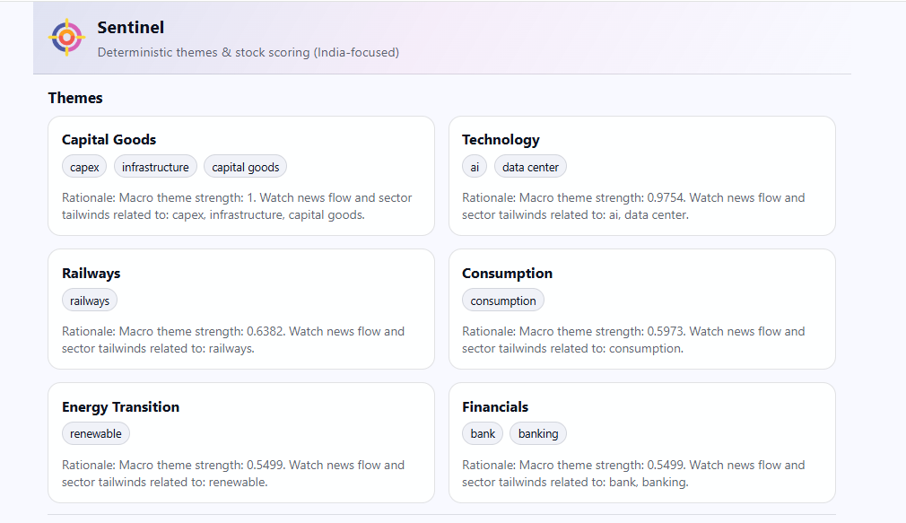
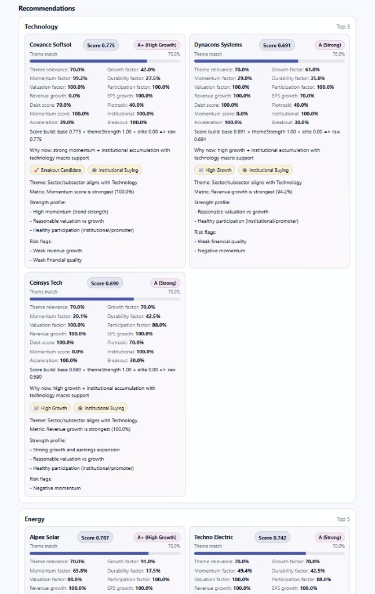

# Sentinel - Find High-Growth Indian Stocks from Macro Trends

<p align="center">
  
</p>

**Sentinel** is a macro-driven stock discovery engine that identifies which stocks are most likely to benefit from emerging economic and sector trends.

Instead of screening stocks in isolation, Sentinel starts with what is happening in the real world - infrastructure spending, energy transitions, AI adoption - and maps those trends to stocks using deterministic logic and growth-focused scoring.

Sentinel helps you answer:
**"What stocks benefit from what is happening right now in the market?"**

## Product Preview

### Themes Dashboard



### Recommendations + Stock Ingestion



## Why Sentinel

Most tools answer:
**"What stocks look good?"**

Sentinel answers:
**"What stocks are positioned to benefit from what is happening right now?"**

It bridges the gap between:
- macro trends (news, sector flows)
- and actionable stock ideas

With:
- deterministic mapping (no black-box AI picks)
- growth-focused scoring (momentum + acceleration)
- clear reasoning for every recommendation

## Core Features

- Dynamic macro theme extraction from trusted Indian finance sources
- Theme-to-stock matching using sector/subsector + keyword overlap
- Composite stock scoring using growth, momentum, ownership, valuation, and acceleration
- Clear "why now", conviction, tier, and signal outputs
- Web UI for fast experimentation with JSON/CSV/Excel-style pasted data
- Chrome extension popup (local backend mode) for lightweight monitoring

## Tech Stack

### Backend (`backend/`)
- Node.js + Express 5
- TypeScript
- Zod validation for robust input parsing
- Optional Tavily integration for macro source retrieval
- Optional OpenAI integration for keyword extraction and reason polishing

### Web App (`webapp/`)
- Vanilla HTML/CSS/JavaScript
- Single-page local interface served by backend
- Rich stock ingestion parser (JSON, CSV, TSV, pasted tables)

### Browser Extension (`extension/`)
- Manifest V3
- Popup UI calling `http://localhost:3000`

## How It Works (User Flow)

1. Sentinel fetches macro data (or fallback themes if APIs are not configured).
2. Macro text is converted into theme keywords and normalized to known sector themes.
3. You submit stock data via JSON/CSV/TSV/pasted screener table.
4. Stocks are validated, normalized, and optionally tag-enriched.
5. Stocks are ranked per theme with explainable score breakdowns.
6. UI renders top picks with reasons, tiers, and confidence signals.

## API Endpoints

- `GET /health` - service health check
- `GET /trends` - macro-driven themes
- `GET /themes` - alias of trends output
- `GET /recommendations` - ranked recommendations by theme
- `POST /stocks` - ingest stock payload (JSON/CSV/text)

## Local Setup

### 1) Clone and install backend deps

```bash
git clone https://github.com/somthebuilder/Sentinel_Finance.git
cd Sentinel_Finance/backend
npm install
```

### 2) Configure environment

```bash
cp .env.example .env
```

Set values in `backend/.env`:
- `TRAVILY_BASE_URL`
- `TRAVILY_API_KEY`
- `TRAVILY_TIMEOUT_MS`
- `TRAVILY_INCLUDE_DOMAINS`
- `OPENAI_API_KEY` (optional)
- `OPENAI_MODEL` (optional, default available in example)
- `PORT`

### 3) Build and run

```bash
npm run build
npm run start
```

Open: [http://localhost:3000](http://localhost:3000)

## Input Format (Minimum)

Each stock row supports fields like:
- `name`
- `symbol`
- `exchange`
- `sector`
- `subSector`
- `tags`
- `revenueGrowth`
- `previousRevenueGrowth`
- `peRatio`
- `institutionalOwnership`
- `momentumScore`

## Current Problems Being Solved

- **Signal quality in noisy macro news**  
  News feeds contain duplicates and low-value updates. Sentinel applies source filtering, deduping, and controlled theme mapping.

- **Mapping messy screener exports into normalized stock records**  
  Different tools use inconsistent headers. Sentinel includes robust aliasing and fallback parsing for real-world CSV/Excel data.

- **Balancing explainability with scoring quality**  
  Black-box outputs reduce trust. Sentinel keeps deterministic scoring and exposes score breakdowns plus reasons.

- **Cold-start dependency risk**  
  If external APIs are unavailable, Sentinel falls back to deterministic theme logic so the app still runs.

## Roadmap

### Phase 1: Signal Quality (Now)
- Improve theme -> stock mapping accuracy
- Strengthen growth + momentum detection
- Add breakout identification signals
- Improve tagging quality

### Phase 2: Decision Layer
- Add "Why now" signals (timing context)
- Add conviction scoring and ranking tiers
- Add leader vs follower detection within themes

### Phase 3: Validation Layer
- Backtest theme -> stock performance
- Track hit rate of recommendations
- Add historical theme performance dashboards

### Phase 4: Execution Layer
- Entry timing signals (breakout vs pullback)
- Position sizing suggestions
- Risk flags and exit signals

### Phase 5: Productization
- Watchlists + alerts
- Portfolio tracking
- Multi-user SaaS

## SEO Keywords

Indian stock market, stock screener, macro trends, AI investing, fundamental analysis, growth investing, stock analysis India.

## Repository Metadata Recommendations

For best GitHub discoverability:
- **Repository name:** `Sentinel_Finance` (already updated)
- **Description:** `Macro-driven stock discovery engine that maps real-world trends to high-growth Indian stocks using deterministic scoring`
- **Suggested topics:** `stock-market`, `india`, `finance`, `investing`, `macro-trends`, `ai`, `stock-analysis`

## Disclaimer

This is a research and decision-support tool, not financial advice. Always do your own due diligence before investing.
